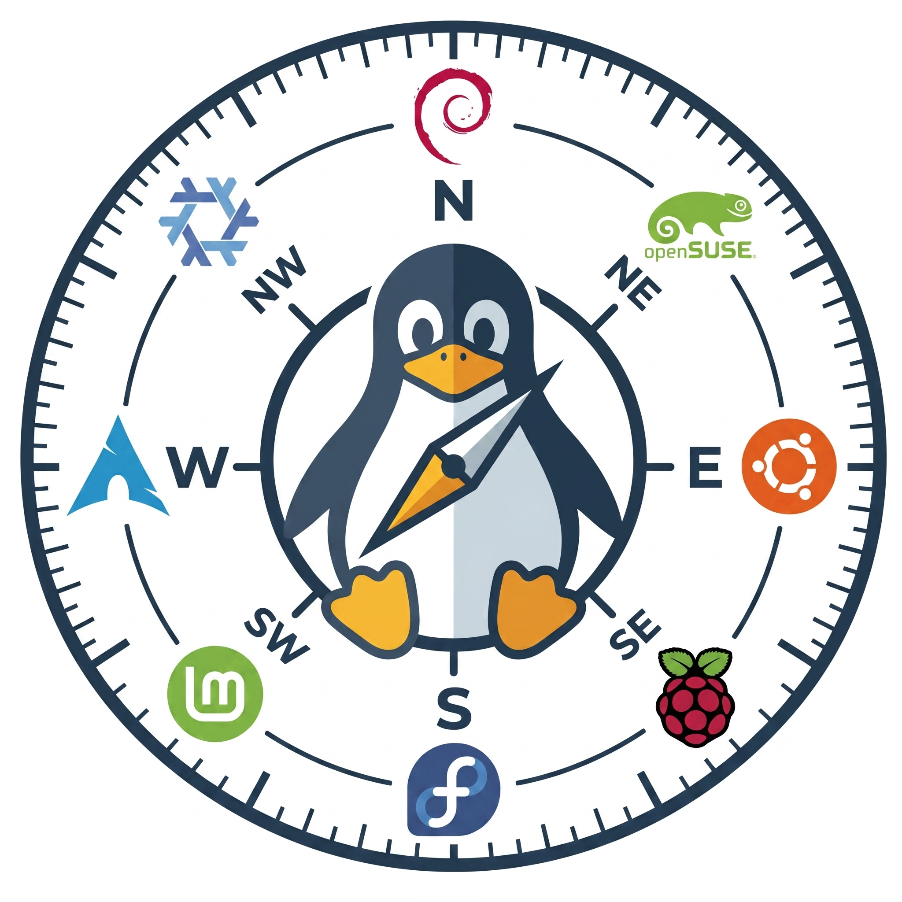
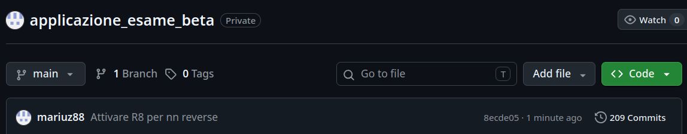

  
  
  # antiDistroHopping
  

## Studenti
* R334000006 - Mario Alfonso Auriemma
* R334000014 - Mario Di Dato
* R334000025 - Antonio Del Grosso
  

## Idea e Innovazione 
La nostra idea nasce da una passione e da un problema concreto. Da anni di uso di Linux e partecipazioni ai Linux Day del Nalug abbiamo capito che moltissimi utenti cadono nella trappola del Distro Hopping. Tale problematica si verifica quando nuovi utenti che si approcciano al mondo Linux cambiano continuamente distribuzioni perchè non sono contenti di qualche feature o più banalmente anche del  desktop environment. Questo ciclo continuo porta nella maggior parte dei casi ad abbandonare il tentativo di passare ad un sistema operativo open-source e ricadere nell'uso di Windows &#x1FAEA;.

La nostra app propone un quiz diverso rispetto alle alternative già presenti (come distrochooser) le quali statiche, con SOLE domande a risposta multipla; che tra l'altro non coprono requisiti specifici hardware. 

antiDistroHopping oltre alle domande (che includono una profondità tecnica maggiore), ha la possibilità di compilare una casella "Altro" in modo tale da esprimere preferenze più specifiche. Si presenta quindi come un'app sia per principianti che per esperti i quali magari vogliono scoprire nuove distribuzioni.

Abbiamo usato per le richieste all'IA tramite API di Groq (produttore di chip appositi per gli LLM) il quale fornisce gratuitamente accesso a vari modelli. Noi abbiamo scelto `llama-3.3-70b-versatile`

## Uso dell'IA
Nello sviluppo della nostra App l'IA è stata utilizzata esclusivamente per:
* I) Generazione del logo, abbiammo chiesto a ChatGPT di generare la nostra bussola con i loghi di varie distro
* II) Costruzione del prompt per l'interazione con  `llama-3.3-70b-versatile`, cossichè da avere una domanda che contenga dei dati strutturati in JSON sulle distro (presi da noi su distrowhatch); e per ottenere una risposta ordinata in JSON in modo che riusciamo a dividere e rendere stringa la risposta per usarla nell'app.

**Nota sui Commit:**
Nel Textbook del docente viene detto che la cronologia dei commit è una parte dimostrante del lavoro. In questa repository è presente un singolo commit.
*Perché?*
Siccome la nostra app contiene la chiave API nel `local.properties`, abbiamo lavorato su una repository privata in modo tale che ognuno di noi potesse testare l'app nella sua completezza. Dato che una chiave API non deve mai essere pubblica abbiamo ricreato una repo pulita con `local.properties` nel `.gitignore`.
Alleghiamo immagine dei commit della repo privata:

  
  

## Struttura Progetto

Il progetto segue l'architettura MVVM sfruttando il viewmodel per conservare e scambiare i dati tra i fragment.
* **`app/build.gradle.kts`**
    Script di configurazione sia per le versioni dell'SDK (compile,minime e target), per specificare che la chiave Groq va estratta dal file local_properties, inoltre attiviamo l'R8 (isMinifyEnabled) per ridurre rischi di reverse engeneering, ma non prima di aver escluso dall'offuscamento le classi usate da Retrofit per la comunicazione con la rete.
    In ultimo attiviamo dalle buildFeatures il viewbinding e il buildconfig.

* **`app/src/main/AndroidManifest.xml`**
    Il vero passaporto dell'app. All'interno forniamo le info base dell'app come l'allowbackup="false" per evitare estrazione della nostra cartella mediante adb backup, le regole di estrazione dati e anche la riga usesCleartextTraffic="false" in modo tale da proibire traffico http non sicuro, ma solo criptato.
    Infine seguiamo il concetto di Single Activity Pattern dichiarando una sola activity main, indicandola come quella che viene avviata(.LAUNCHER) cliccando sull'icona dell'app.

* **`app/src/main/res/navigation/nav_graph.xml`**
    Si tratta di un codice XML fondamentale per stabilire le regole di navigazione della nostra app. In pratica, definisce la "mappa stradale" dell'applicazione: specifica l'elenco di tutte le schermate disponibili. Inoltre grazie a questo file il codice Kotlin non dovrà gestire manualmente le transizioni di fragment, bensì basterà indicare al NavController (lo strumento della libreria Jetpack Navigation Component) l'id dell'azione es("@+id/action_homeFragment_to_quizFragmentfragment) o l'id del fragment di destinazione es("@id/quizFragment").

* **`app/src/main/res/layout/activity_main.xml`**
    Questo file XML definsice la gerarchia della UI. Usando un architettura del tipo Single Activity Pattern e MVVM è abbastanza semplice. Infatti useremo un ConstraintLayout dove la nostra MainActivity altro non sarà che un recipiente blu vuoto per i nostri tre possibili fragment che occuperando tutto lo spazio offerto dallo schermo mediante il comando '0dp' sia per il width che per l'height che concede al fragment di espandersi fino a riempire tutto lo spazio disponibile

* **`/app/src/main/java/com/mario/beta_antidh/MainActivity.kt`**  
    L'Activity principale dell'app. Punto di ingresso logico della nostra app. Funge da contenitore per i nostri tre fragment.

  
* **`/app/src/main/java/com/mario/beta_antidh/vista/` (UI Layer)**  
      Contiene i Fragment responsabili dell'interfaccia utente grafica, passeremo da uno all'altro sfruttando il navcontroller fornito dalla libreria Jetpack Navigation Component:

  * `HomeFragment.kt`: La schermata iniziale che accoglie l'utente e premendo il pulsante "Inizia il viaggio" gli permette di iniziare il quiz di 10 domande.
  * `QuizFragment.kt`: Schermata con le domande gestite in maniera dinamica e permette di raccogliere l'input dell'utente mediante viewmodel per "accendere" il bottone corrispondente. Premendo il pulsante "analizza" alla fine della 10° domanda avverrà l'invio delle domande a Groq e inizierà l'analisi dell'IA passando mediante NavController al fragment che gestisce il risultato.
  * `ResultFragment.kt`: Mostra all'utente la distribuzione Linux ideale elaborata a fine quiz, stampando i risultati ricevuti,insieme a due alternative altrettanto valide.

* **`/app/src/main/java/com/mario/beta_antidh/viewmodel/QuizViewModel.kt`**  
      Il QuizViewModel  gestisce la logica del programma permettendo all'utente di scorrere le domande in maniera dinamica (sia avanti che indietro). Permette al ViewModel di comunicare con l'ui mediante la dichiarazione di variabili di tipo LiveData che conservano lo stato dell'app in maniera sicura anche in caso di rotazione dello schermo. Gestisce la comunicazione con la rete senza bloccare il main thread rischiando di provocare un ANR (Android Not-Responding) mediante l'utilizzo delle coroutine(suspend fun chatCompletions).

* **`/app/src/main/java/com/mario/beta_antidh/rete/` (Network Layer)**  
      Gestisce l'intera comunicazione HTTP verso l'esterno:
  * `RetrofitClient.kt`: Un Singleton che inizializza l'interceptor che permette di riportare le informazioni delle comunicazione nel logcat solo in fase di debug, l'OkHttp che prende l'interceptor precedentemente creato e i tempi massimi di attesa di risposta della rete(60 secondi). infine costruisce il Retrofit includendo il base Url di groq, l'OkHttp e il convertitore GSON da Json che riceviamo come risposta Ai in oggetto Kotlin.
  * `GroqApiService.kt`: Interfaccia Retrofit che definisce l' endpoint con la chiamata POST e definsice i parametri della coroutine per comunicare correttamente con la rete.

* **`/app/src/main/java/com/mario/beta_antidh/modello/` (Data Layer)**  
     Contiene le "Data Class" Kotlin,scelte per la loro versatilità e per i metodi di base già creati, per la serializzazione e deserializzazione dei dati:

  * `Domanda.kt`: Struttura dati per le singole domande (testo, lista opzioni, regole UI).
  * `GroqModelli.kt`: contiene le strutture da inviare all'Ai ovvero GroqMessage e GroqRequest che sarà la data class finale che inviamo all'Ai definendo il messaggio (di tipo GroqMessage), il modello Ai da utilizzare, il suo livello di previdibilità(temperature, 0.7 standard) e infine il numero massimo di token.
  * `Distro.kt`: contiene la struttura usate per interpretare e formattare la risposta finale dell'Ai.

## Risorse
* Textbook docente Raffaele Montella
* [Documentazione Ufficiale Android](https://developer.android.com/)
* [Documentazione Ufficiale Kotlin](https://kotlinlang.org/docs/home.html)
